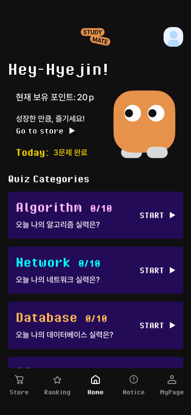
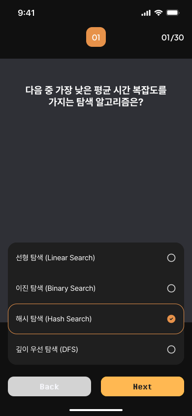
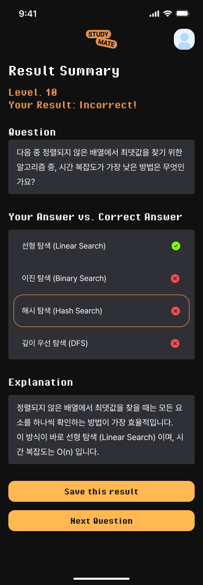

[![Contributors][contributors-shield]][contributors-url]
[![Issues][issues-shield]][issues-url]
[![Unlicense License][license-shield]][license-url]

 

  

  <h2 align="center">Study Mate 스터디 메이트</h2>

  

    개발자를 위한 문제 풀이 & 학습 커뮤니티
     
    <!-- <a href="https://github.com/othneildrew/Best-README-Template"><strong>Explore the docs »</strong></a>
      -->
     
    <a href="https://developer-dev.study-mate.academy">웹사이트 바로가기</a>
    &middot;
    <a href="https://github.com/night-shift-team/study-mate-fe/issues/new?labels=bug&template=bug-report---.md">버그 리포트</a>
    &middot;
    <a href="https://github.com/night-shift-team/study-mate-fe/issues/new?labels=enhancement&template=feature-request---.md">기능 제안</a>
  

  
목차

  <ol>
    <li>
      <a href="#프로젝트-소개">프로젝트 소개</a>
      <ul>
        <li><a href="#✅-핵심-기능">핵심 기능</a></li>
        <li><a href="#⚒️-사용-기술">사용 기술</a></li>
      </ul>
    </li>
    <li><a href="#서비스-이용">서비스 이용</a></li>
    <li><a href="#로드맵">로드맵</a></li>
    <li><a href="#팀-및-기여자">팀 및 기여자</a></li>
    <li><a href="#라이센스">라이센스</a></li>
    <li><a href="#문의">문의</a></li>
  </ol>

---

## 프로젝트 소개

 

<!-- [![Thumbnail-1][product-thumbnail-1]](https://developer-dev.study-mate.academy/thumbnails/mainThumbnail_1.svg) [![Thumbnail-2][product-thumbnail-2]](https://developer-dev.study-mate.academy/thumbnails/mainThumbnail_2.svg) [![Thumbnail-3][product-thumbnail-3]](https://developer-dev.study-mate.academy/thumbnails/mainThumbnail_3.svg) -->

  

**Study Mate**는 개발자를 위한 문제 풀이 중심의 학습 플랫폼입니다.  
AI 기반 문제 생성, 랭킹 시스템, 상점 기능을 통해  
자신의 성장 수준을 확인하고, 함께 학습하는 동료들의 여정을 살펴볼 수 있는 경험을 제공합니다.

 

### 서비스 목표

- 개발자들이 기초 CS 지식을 지속적으로 학습할 수 있는 공간
- 학습 과정을 시각적으로 관리하고 리마인드 할 수 있는 화면 제공
- 학습도 기반 문제 추천 및 실시간 랭킹을 통한 몰입형 학습 환경 제공

 

### 핵심 기능

1. 카테고리별 문제 풀이  
   네트워크, 운영체제, 데이터베이스, 알고리즘 등 개발 핵심 분야별 문제를 제공합니다.

2. 사용자 학습도 기반 문제 제공  
   사용자 수준에 맞는 문제를 제공하여 개인화된 학습 경험을 제공합니다.

3. 랭킹 시스템  
   풀이 결과를 기반으로 나와 유저의 실시간 랭킹을 확인 할 수 있습니다.

4. 상점 기능  
   문제 풀이로 얻은 포인트를 활용해 추가 풀이 기회나 아이템을 구매할 수 있습니다.

 

### 사용 기술

[![Next][Next.js]][Next-url]
[![React][React.js]][React-url]
[![Typescript][Typescript]][Typescript-url]
[![TailwindCSS][TailwindCSS]][TailwindCSS-url]
[![Zustand][Zustand]][Zustand-url]

> 프런트엔드는 **Next.js 기반 SSR & CSR 하이브리드 구조**로 구성되어 있으며,  
> 백엔드는 **Spring Boot + Gradle + JPA** 구조로 설계되었습니다.

 

## 서비스 이용

Study Mate는 웹 브라우저에서 바로 이용할 수 있습니다.

> [https://developer-dev.study-mate.academy](https://developer-dev.study-mate.academy)

**소셜 로그인 지원:**

- Google 계정으로 간편 로그인

 

추후 Github 로그인 등 다른 소셜 로그인 기능 추가 예정

 

## 로드맵

- [완료] MVP 런칭 (문제 풀이 + 랭킹 + 공지 + 상점 + 로그인)

- 2025 4Q - AI 문제 자동 생성

최신 업데이트 및 제안된 기능은  
👉 [이슈 페이지](https://github.com/night-shift-team/study-mate-fe/issues)에서 확인할 수 있습니다.

 

## Team & Contributors

Study Mate는 Night Shift Team 에 의해 개발되었습니다.

서비스 개선을 위한 기여는 언제나 환영합니다 💬

### Team

<table >
  <tr >
    <td align="center">
      dinn54
    </td>
    <td align="center">
      rhdustn
    </td>
    <td align="center">
      blockmonkey1992
    </td>
    <td align="center">
      HHJ
    </td>
  </tr>
  <tr>
    <td align="center">
      
    </td>
    <td align="center">
        
    </td>
        <td align="center">
        
    </td>
        </td>
        <td align="center">
        
    </td>
  </tr>
</table>

### Contributors

<a href="https://github.com/night-shift-team/study-mate-fe/graphs/contributors">**Study Mate FE - dinn54, rhdustn**
</a>

  

## 라이센스

이 프로젝트에 관한 모든 권리는 Night Shift Team에 있습니다. 

상세 내용은 [`LICENSE.txt`](LICENSE.txt)를 참고하세요.

 

## 문의

**주정혁 (JOOJEONGHYEOG)**

- 📧 Email: [joodinner@gmail.com](mailto:joodinner@gmail.com)
- 💼 LinkedIn: [@joodinner](https://www.linkedin.com/in/정혁-주-10819137b)

(<a href="#readme-top">back to top</a>)

---

<!-- MARKDOWN LINKS & IMAGES -->

[contributors-shield]: https://img.shields.io/github/contributors/night-shift-team/study-mate-fe.svg?style=flat-square
[contributors-url]: https://github.com/night-shift-team/study-mate-fe/graphs/contributors
[issues-shield]: https://img.shields.io/github/issues/night-shift-team/study-mate-fe.svg?style=flat-square
[issues-url]: https://github.com/night-shift-team/study-mate-fe/issues
[license-shield]: https://img.shields.io/badge/License-Night_Shift_Team_Proprietary-black.svg?style=flat-square
[license-url]: https://github.com/night-shift-team/study-mate-fe/blob/dev/LICENSE.txt
[product-thumbnail-1]: https://developer-dev.study-mate.academy/thumbnails/mainThumbnail_1.svg
[product-thumbnail-2]: https://developer-dev.study-mate.academy/thumbnails/mainThumbnail_2.svg
[product-thumbnail-3]: https://developer-dev.study-mate.academy/thumbnails/mainThumbnail_3.svg
[Next.js]: https://img.shields.io/badge/Next.js-000000?style=for-the-badge&logo=nextdotjs&logoColor=white
[Next-url]: https://nextjs.org/
[TailwindCSS]: https://img.shields.io/badge/Tailwind_CSS-grey?style=for-the-badge&logo=tailwind-css&logoColor=38B2AC
[TailwindCSS-url]: https://tailwindcss.com/
[Typescript]: https://img.shields.io/badge/TypeScript-3178C6?logo=typescript&style=for-the-badge&logoColor=fff
[Zustand]: https://img.shields.io/badge/zustand-602c3c?style=for-the-badge&logo=data:image/png;base64,iVBORw0KGgoAAAANSUhEUgAAAA4AAAAOCAMAAAAolt3jAAAA8FBMVEVHcExXQzpKQDlFV16lpqyGh4tPPTdWT0weHRU7LRZGQzmxYjlaTkZsbmywVyxtXDSFhISXm6WWpcaytb6bm56gprY0LiiXmp2prLamsMa0XS42MSxkTUVDSkuyYzGihXdDV2GprbmedVxaRD1kTUWUdGFGOCN4a2OfpbI0SFFAMSddTkbCc0dWQiGFRypXQyJUQCBcTTWviDVXQyJcUDjlqCWxjkG+hBTiohtURD6lr8lORTtDVVZmPyxwSipaRSJDOzaWpsyYqMyYqM2dq8tPOjBERTs6QUKTcCeKaCJvViZdSDK4iSngoiDvqx7KkRuGEi1hAAAAOXRSTlMApZ78cB8hCAMQO/j/FOH4KlT1wFfJTjaY6SxtVexFn3Tn2sN6d671mVuJ+/PPN9CT6TfpS4C9jJaVLRihAAAAi0lEQVQIHXXBxRKCUAAF0Es/QMDubsVuGrv1///GBQ4bx3PwgwC8gFCRohs8QrQV0ZtKOZ9JcgBmU8MwqFa9kjNTUWB58f2jPOjU9juTBTbPq+vIar972MZjwPr1uDvqCFw2wQpQVm/t7Oo9gAgAFtrtZNtMFQFp7nkWU5IQECfjYbuQFvBFRJHgjw9L0A80UmaGpAAAAABJRU5ErkJggg==
[Zustand-url]: https://zustand-demo.pmnd.rs/
[Typescript-url]: https://www.typescriptlang.org/
[React.js]: https://img.shields.io/badge/React-20232A?style=for-the-badge&logo=react&logoColor=61DAFB
[React-url]: https://reactjs.org/
